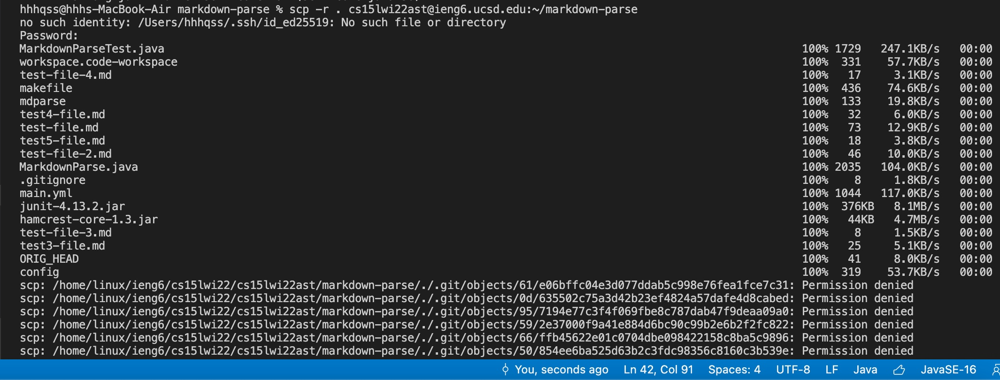
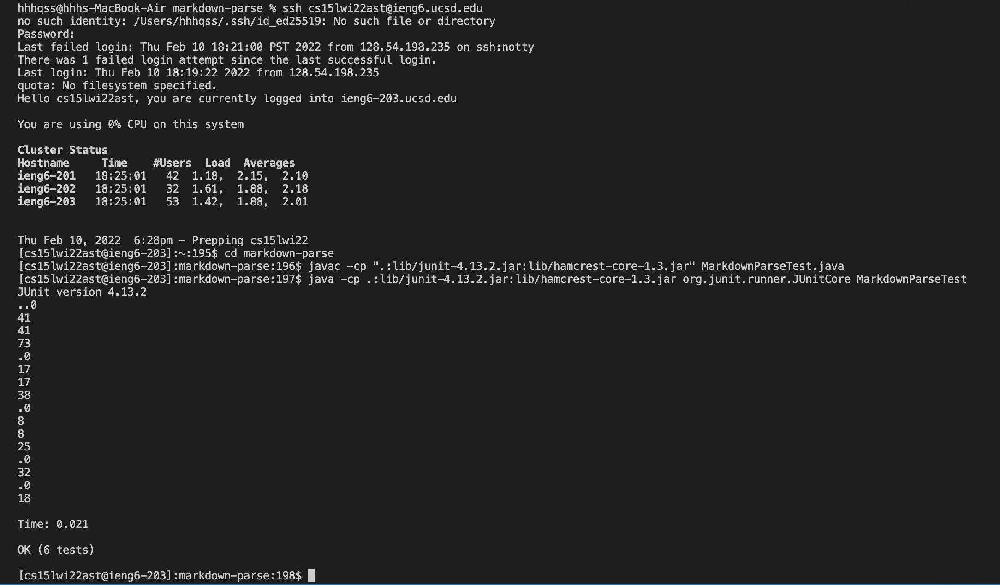
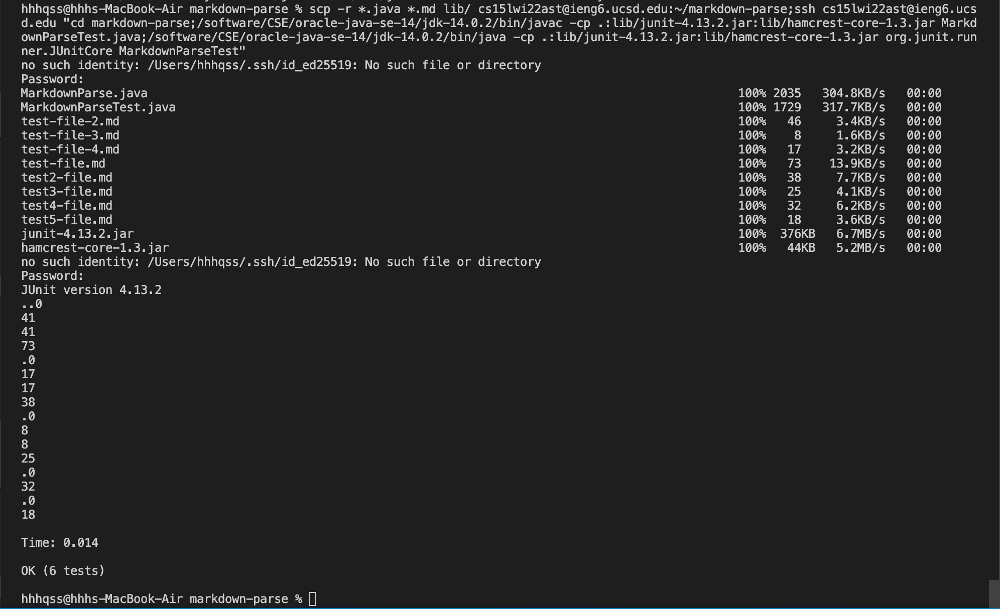

# CSE 15L Lab Report 3
## copy whole directories with `scp -r`
The following tutorial shows how to copy a folder from local machine to `ieng6` server and run the Java programs inside. A shortcut that merge copying, server logging in, compiling and running into one command line is also shown.

__step 1: copy markdown-parse directory to `ieng6` with `scp -r`__   
Open terminal and use and go to the folder we want to copy.  
Type in `scp -r . <ieng6 account> ~/<folder name>` with content in the angle brackets replaced and press enter. The copy process would start. A folder named the `<folder name>` will be created in the server.

__step 2: compile and run Java program__  
Log into `ieng6` server with `ssh`. Compile and run MarkdownParseTest.java with necessary Junit files.

__step 3:copy,compile,log in and run within one line by `;` and `""`__  
`;` seperates the commands, and putting commands inside `""` after the `ssh` command would make the commands automatically execute after we logged into the server.  
The steps we take to copy and run the program are: copy directory, log into the server, go to the pasted directory and compile and run the program. Therefore, type in  
`scp -r *.java *.md lib/ cs15lwi22ast@ieng6.ucsd.edu:~/markdown-parse;ssh cs15lwi22ast@ieng6.ucsd.edu "cd markdown-parse;/software/CSE/oracle-java-se-14/jdk-14.0.2/bin/javac -cp .:lib/junit-4.13.2.jar:lib/hamcrest-core-1.3.jar MarkdownParseTest.java;/software/CSE/oracle-java-se-14/jdk-14.0.2/bin/java -cp .:lib/junit-4.13.2.jar:lib/hamcrest-core-1.3.jar org.junit.runner.JUnitCore MarkdownParseTest"`  
and press Enter to run.

