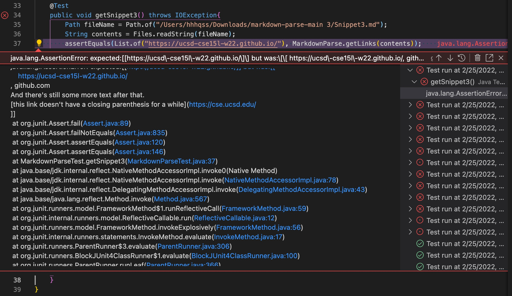

# CSE 15L Lab Report 4
## previews of Snippets 1&2&3:

## implementation of tests of the Snippets

## running the tests with my MarkdownParse.java
## All three tests failed

## running the tests with MarkdownParse.java I reviewed in lab 7
## All three tests failed

## small code change(<10 lines) that will make my program run correctly for Snippet1(inline backticks) and similar cases?
No. I think I have to add code that search for backticks between pairs of `[]`,`](` and `()`. If there is an even number of backticks in between, the content between () should still be involed in expected output. Otherwise we jump over the next backtick and search for the next `[`. I think even if I implement a helper function that counts the backticks in a string to reduce the amount of code change, the total lines would still go beyond 10.
## small code change<(10 lines) that will make my program run correctly for Snippet2(nested brackets/parentheses) and similar cases?
No. As implemented in this [Joe's markdownparse edited](https://github.com/m1ma0314/Joe-s-markdownParse-edited/blob/master/MarkdownParse.java) file, we use a stack to find the corresponding close brackets/parentheses of the current bracket/parenthese. I think this is already an effective and concise strategy to solve the problem, but it takes more than 10 lines.
## small code change<(10 lines) that will make my program run correctly for Snippet3(newlines in brackets and parentheses) and similar cases?
No. Similar to the error in Snippet 2, I have to add code for finding the corresponding symbol for `[` ,`]`,`(` and `)` with a stack to avoid taking `......(...` from `(......(...)..)`, which would take more than 10 lines even if I implement it with a loop.
