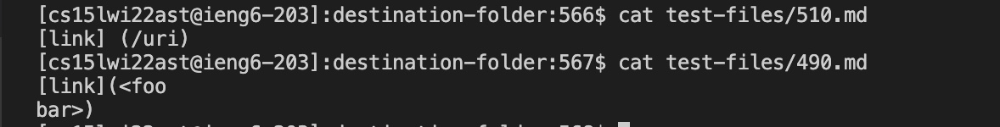
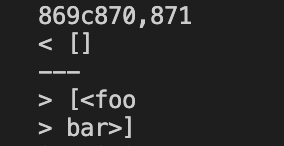
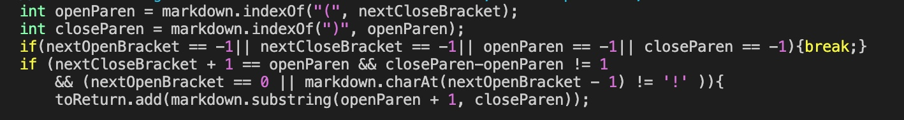
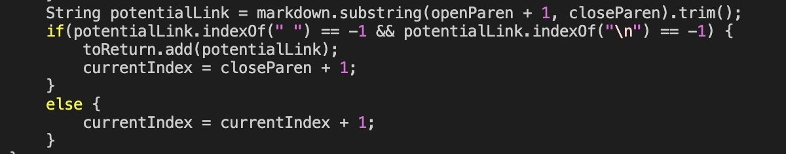
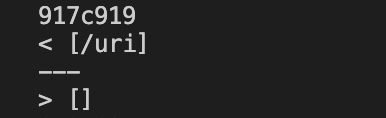
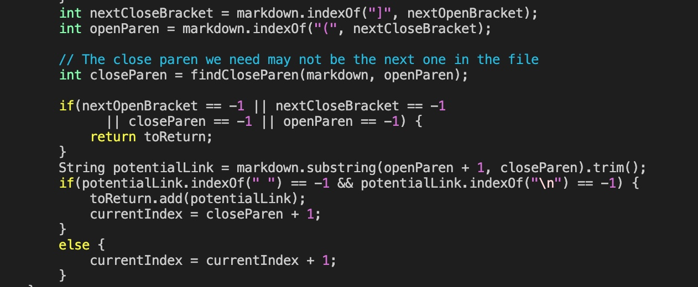
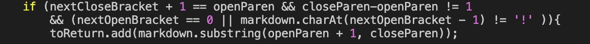

# Lab Report 5
## The output on test case __490__ and __510__ are different.
I found out this difference with `diff`.  
The contents __above__ `---` are outputs of MarkdownParse.java in __Joe's__ repository.  
The contents __below__ `---` are outputs of MarkdownParse.java in __my__ repository.  
texts in `test-files/490.md` and `test-files/510.md`

## description of correct output and existing bugs when testing `test-files/490.md`:  
I think the expected output is  
`[]`  
because a string in which a line break exists should not be a URL.  
output when testing `test-files/490.md`:  
  
According to the actual output I think __Joe's__ implementation is __correct__ for test `490.md`.  

__description of the bug__ in __my MarkdownParse.java__:  
This is the implementation in __my__ MarkdownParse.java where the link is added to the result ArrayList `toReturn`
  
This is the implementation in __Joe's__ MarkdownParse.java where the link is added to the result ArrayList `toReturn`
  
 My implementation doesn't check for the condition Joe's implementation checks. In Joe's MarkdownParse.java, we see that if `potentialLink.indexOf("\n")==-1`, which means __no__ line break exists in `potentialLink`,then the link is not added to result. 

## description of correct output and existing bugs when testing `test-files/510.md`: 
I think the expected output is  
`[]`  
because there is a white space between `]` and `(`  
output when testing  `test-files/510.md`:  
  
According to the actual output I think __my__ implementation is __correct__ for test `510.md`.  

__description of the bug__ in __Joe's MarkdownParse.java__:  
This is the implementation in __Joe's__ MarkdownParse.java  

This is the implementation in __my__ MarkdownParse.java  

Joe's implementation doesn't check for the condition my implementation checks. In my implementation, the substring would be added to result only if `nextCloseBracket + 1 == openParen`, which means the `]` and `(` are next to each other. Joe's implementation doesn't check for this condition.