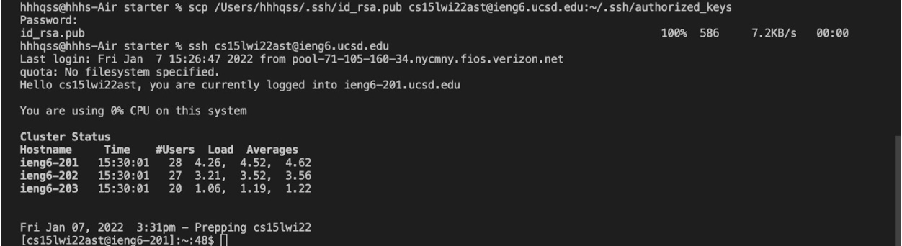

# CSE 15L Lab Report-week 1
## how to log into a course-specific account on `ieng6`
## __Step1: install Visual Studio code__
Google vscode download and select the download package corresponding to your OS  

Open VScode, you should be at a home page like this.  
Depending on the default theme setting, it could be white.

## __Step2: connect to remote ieng6 sever__
First, you need to look up your ieng6 account name at [here](https://sdacs.ucsd.edu/~icc/index.php).    
Follow the instructions there to reset your account's password, so that your `ieng6` account can be activated.Take a note of your new password. It's needed for remote server login.

After resetting your password, open terminal in VScode by clicking "Terminal"-"New Terminal",and type in the following command with `zz` replaced by letters in your course-specific account.  
`$ ssh cs15lwi22zz@ieng6.ucsd.edu`  
For all yes/no questions poping up, type yes.  
e.g.:  
`The authenticity of host 'ieng6.ucsd.edu (128.54.70.227)' can't be established.
RSA key fingerprint is SHA256:ksruYwhnYH+sySHnHAtLUHngrPEyZTDl/1x99wUQcec.
Are you sure you want to continue connecting (yes/no/[fingerprint])?`  

Type in your new password you just reset when `Password:` appears, and you should have logged into your remote `ieng6` server.  
__Note:__ No characters will appear when you are typing your password.

If the password is wrong it's probably because the password change has not took effect yet or `ieng6` server is currently experiencing some problems.Try again later.  
## __Step3: try some commands__
Once you log into `ieng6` account you should see it from the command line, and you can try some linux commands such as:  
`cd ~`  
`cd`  
`ls -a`  
`pwd`  

See what happens for each command. You can also google for some other linux commands to try such as `cp` and `cat`  
## __Step4: copy file to `ieng6` with scp command__  
To log out from `ieng6` server, type `exit` in command line.  
Now create a new file called `WhereAmI.java` and paste the following into the file.  
`class WhereAmI {
  public static void main(String[] args) {
    System.out.println(System.getProperty("os.name"));
    System.out.println(System.getProperty("user.name"));
    System.out.println(System.getProperty("user.home"));
    System.out.println(System.getProperty("user.dir"));
  }
}`  

Go to terminal in VScode again. Use `cd` to enter the directory where `WhereAmI.java` is created,(you can try to run it with `javac` and `java`) and type in the following with `zz` replaced with letters in your own account:  
`scp WhereAmI.java cs15lwi22zz@ieng6.ucsd.edu:~/`  
Type in the password used for login and press enter, and the file copying should start.

Now login to `ieng6` server again and you can see the file there. Try to run it with `javac` and `java` and see the difference.

## __Step5: set up SSH key__  
You may noticed it takes you quite a long time to log into the server, especially when you are doing some task that require you to switch between the server and your own computer.  
Here's a solution. Type in the following command in terminal:  
`$ ssh-keygen`  
Press enter and you will see questions pop up. Just press enter for all of them. In the end you will see results like this:

This means 2 key-files have been created for you in your computer in the path shown. One called id_rsa, another called id_rsa.pub.  
Now use `ssh` to login to the server again.(In terminal, you can press up arrow on keyboard to invoke commands you used before)
Create a folder called `.ssh` there with `mkdir` command. (Search on Google!) you can use `ls` to make sure the folder exits. After you finish log out with `exit`.  
Back to your computer, use `scp` to copy `id_rsa.pub` to .ssh folder in the server:
`scp <path>/.ssh/id_rsa.pub cs15lwi22zz@ieng6.ucsd.edu:~/.ssh/authorized_keys`  
with `<path>` and `zz` replaced by the path `id_rsa.pub` resides on your computer and the letters in your `ieng6` account, respectively.
Once this is done, try to log into the server with `ssh` again. But this time you should not have to type in the password.

## __Step 7: make remote running more efficient__  
There are still other ways to simplify the operations we did above.  
e.g.1 : type in local terminal (replace `zz`)  
`$ ssh cs15lwi22zz@ieng6.ucsd.edu "ls"`  
See what happens. You can type in commands right after the `ssh` command with double quotation to execute it as soon as you log into the server.  

e.g.2 : type in server terminal  
`$ ls;cp WhereAmI.java Downloads`   
See what happens with:  
`$ cd Downloads;ls`   
After showing the components of home directory, `WhereAmI.java` is copied into `Downloads` directory.

Now you can try to combine the previous 2 skills. Back to your local computer,type in local terminal:  
`$ ssh cs15lwi22zz@ieng6.ucsd.edu "ls;pwd;cd Download;pwd"`
