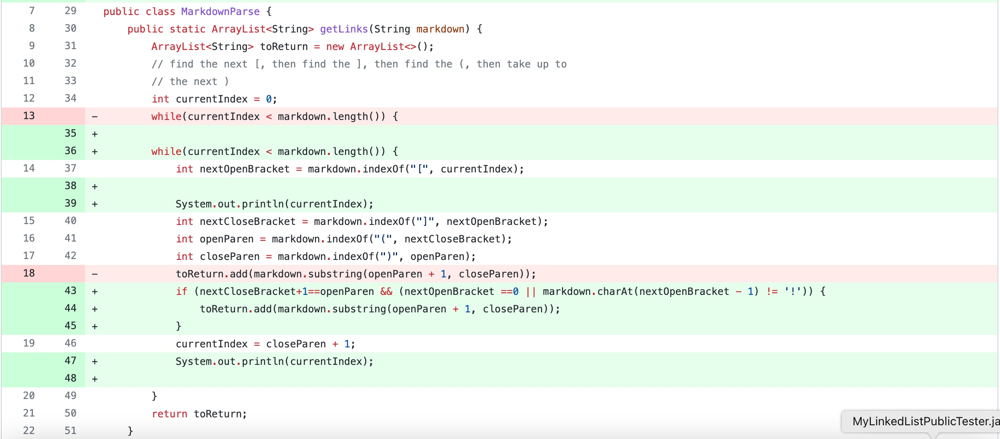
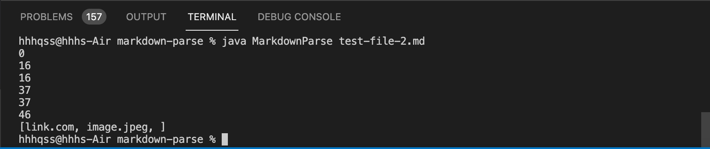
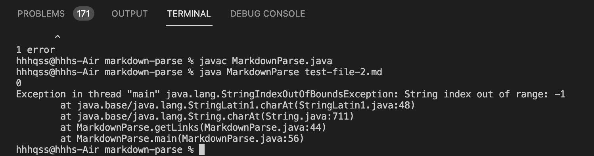

# CSE 15L Lab Report-2

## change __No.1__    
__line 43__ add statement  
`if(markdown.charAt(nextOpenBracket - 1) != '!')`  
This change intends to address the incorrect output caused by a image link. Image link should not be included in the collections of URLs.The `if` statement prevent any image link to be added to the output.  
__bug__: program would read image links  
link to the failure-inducing input:  
[failure-inducing input-1](test-file-2.md)  
__symptom__: image link included in the output
 
___
## change __No.2__    
__line 43__ changed to:
`if(nextOpenBracket==0 || markdown.charAt(nextOpenBracket - 1) != '!')`  
This change intends to address the StringIndexOutOfBoundsException thrown when running the program after change No.1 with a input file that begins with a closed bracket `[`   
__bug__: program throws error when the input file starts with a `[`  
link to the failure-inducing input:  
[failure-inducing input-2](test-file-3.md)  
__symptom__: `StringIndexOutOfBoundsException` thrown
 
___
## change __No.3__    
__line 43__ changed to: 
`if (nextCloseBracket+1==openParen && (nextOpenBracket ==0 || markdown.charAt(nextOpenBracket - 1) != '!'))`  
This change intends to address the incorrect output when input a file that has pairs of close brackets `[]` and open brackets `()` that are not adjacent, which means the close and open brackets are not used for link.  
__bug__: program would include content in a pair of open bracket while it's not adjacent to a prior pair of closed bracker, which means the text within is not a URL.  
link to the failure-inducing input:       
[failure-inducing input-3](test-file-4.md)  
 __symptom__: ppap isn't a URL but included in the output.
 .jpg)